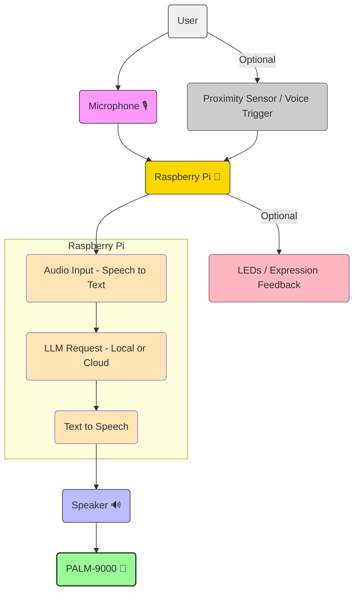

# PALM-9000
PALM-9000 is a Raspberry Pi and LLM–powered talking palm tree—ever-watchful, eerily articulate, and not entirely sure it should let you prune that branch.

# 🌴 Architecture Diagram Outline

