# PALM-9000
PALM-9000 is a Raspberry Pi and LLM–powered talking palm tree—ever-watchful, eerily articulate, and not entirely sure it should let you prune that branch.

# 🌴 Architecture Diagram Outline

```mermaid
flowchart TD
    user(User) --> mic(Microphone 🎙️)
    mic --> pi(Raspberry Pi 🧠)
    
    subgraph Raspberry Pi
        pi_in(Audio Input - Speech to Text)
        pi_llm(LLM Request - Local or Cloud)
        pi_out(Text to Speech)
    end

    pi --> pi_in
    pi_in --> pi_llm
    pi_llm --> pi_out
    pi_out --> speaker(Speaker 🔊)
    speaker --> palm(PALM-9000 🌴)

    %% Optional enhancements
    user -->|Optional| sensor(Proximity Sensor / Voice Trigger)
    sensor --> pi
    pi -->|Optional| leds(LEDs / Expression Feedback)

    style user fill:#f0f0f0,stroke:#333,stroke-width:1px
    style mic fill:#f9f,stroke:#333
    style pi fill:#ffd700,stroke:#333,stroke-width:1px
    style pi_in fill:#ffe4b5
    style pi_llm fill:#ffe4b5
    style pi_out fill:#ffe4b5
    style speaker fill:#bbf,stroke:#333
    style palm fill:#98fb98,stroke:#333,stroke-width:2px
    style sensor fill:#ccc,stroke:#666
    style leds fill:#ffb6c1,stroke:#666
```



# How to Enable Acoustic Echo Cancellation (AEC) on Headless Raspberry PI via macOS

Raspberry PI's sound server PulseAudio can be configured to use Acoustic Echo Cancellation (AEC) to reduce echo from the speaker when using a microphone. The following setup assumes you are connecting to a headless 64-bit Raspberry Pi from macOS.

On macOS, install an X server (e.g., XQuartz).
```sh
brew install --cask xquartz
```

After installing, log out and log back in (or reboot) so `$DISPLAY` is set correctly on macOS.
```sh
echo $DISPLAY
```

You should see something like this:
```sh
/private/tmp/com.apple.launchd.N7l0ZjE86u/org.xquartz:0
```

Login to the raspberry pi with X11 forwarding enabled. This will allow you to see the GUI from your Raspberry Pi on your macOS.
```sh
ssh -Y <username>@<raspberry_pi_ip>
```

Now inside the Raspberry Pi, install PulseAudio and its utilities. PulseAudio is probably already installed on the Raspberry Pi, but you may need to install pavucontrol.
```sh
sudo apt update
sudo apt install pulseaudio pulseaudio-utils pavucontrol
```

Manually enable AEC.
```sh
pactl load-module module-echo-cancel \
    source_name=echosource sink_name=echosink \
    aec_method=webrtc
```

Make sure the AEC devices exist. You should see something like `echosource` and `echosink`.
```sh
pactl list short sources
pactl list short sinks
```

Run pavucontrol on the Raspberry Pi.
```sh
pavucontrol
```

You should see a window like this appear on your macOS. Go to the Output Devices and Input Devices tabs and click the green icon next to the option showing "echo cancelled" in the title.


Now go back to the Raspberry Pi and confirm it's working.
```sh
pactl info | grep "Default Sink"
pactl info | grep "Default Source"
```

You should see:
```sh
Default Sink: echosink
Default Source: echosource
```

### Set as default (optional)

To set AEC as the default, edit the PulseAudio configuration file.
```sh
sudo vi /etc/pulse/default.pa
```

Add at the end:
```sh
load-module module-echo-cancel source_name=echosource sink_name=echosink aec_method=webrtc
set-default-source echosource
set-default-sink echosink
```

Save, then restart PulseAudio:
```sh
pulseaudio -k
pulseaudio --start
```

### Test

To test that AEC is working, we'll record our voice while playing audio through the speaker. If AEC is working correctly, we should only hear our voice in the recording, while the audio from the speaker is removed.

First, prepare a sample audio file to play through the speaker.
```sh
wget https://download.samplelib.com/wav/sample-3s.wav
```

Record from the AEC source via Pulse. (Note that the `-f cd` option is shorthand for recording 16 bit little endian, 44100 Hz, stereo quality.)
```sh
PULSE_SOURCE=echosource arecord -D pulse -f cd -d 10 test.wav
```

While you're recording, play the sample audio file in a separate terminal and also speak into the microphone.
```sh
# Flow:
#  1. Say: "Test 1, 2, 3"
#  2. Play test audio
aplay sample-3s.wav
#  3. Say: "Test 4, 5, 6"
```

Now play the recording.
```sh
PULSE_SINK=echosink aplay -D pulse test.wav
```

The recording should contain your voice (mic) but little to none of the sample audio being played from the speaker.

# Considerations

- [ ] LED integration for visual feedback
- [ ] Moisture sensor for health monitoring
- [ ] Sunlight sensor for optimal placement
- [ ] AEC
- [ ] YouTube video
- [ ] Larger speaker for better audio
- [ ] Deploy to the cloud for remote access
- [ ] Integrate with ChatGPT, add access to metrics via custom API
