# PALM-9000
PALM-9000 is a Raspberry Pi and LLM–powered talking palm tree—ever-watchful, eerily articulate, and not entirely sure it should let you prune that branch.

# 🌴 Architecture Diagram Outline

```mermaid
flowchart TD
    user(User) --> mic(Microphone 🎙️)
    mic --> pi(Raspberry Pi 🧠)
    
    subgraph Raspberry Pi
        pi_in(Audio Input - Speech to Text)
        pi_llm(LLM Request - Local or Cloud)
        pi_out(Text to Speech)
    end

    pi --> pi_in
    pi_in --> pi_llm
    pi_llm --> pi_out
    pi_out --> speaker(Speaker 🔊)
    speaker --> palm(PALM-9000 🌴)

    %% Optional enhancements
    user -->|Optional| sensor(Proximity Sensor / Voice Trigger)
    sensor --> pi
    pi -->|Optional| leds(LEDs / Expression Feedback)

    style user fill:#f0f0f0,stroke:#333,stroke-width:1px
    style mic fill:#f9f,stroke:#333
    style pi fill:#ffd700,stroke:#333,stroke-width:1px
    style pi_in fill:#ffe4b5
    style pi_llm fill:#ffe4b5
    style pi_out fill:#ffe4b5
    style speaker fill:#bbf,stroke:#333
    style palm fill:#98fb98,stroke:#333,stroke-width:2px
    style sensor fill:#ccc,stroke:#666
    style leds fill:#ffb6c1,stroke:#666
```

